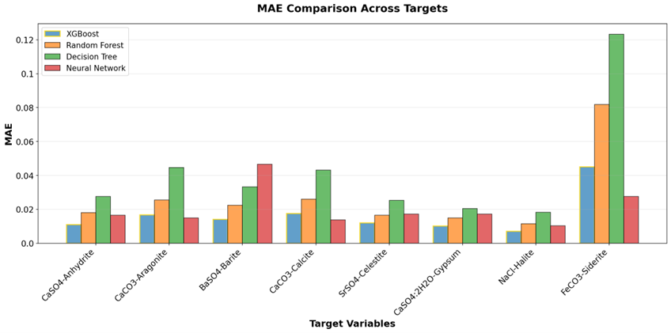
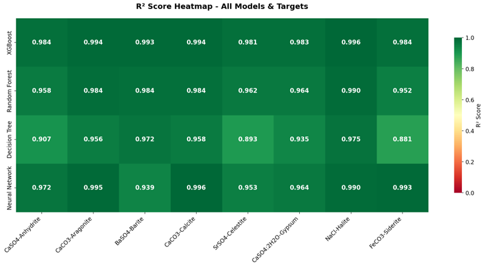
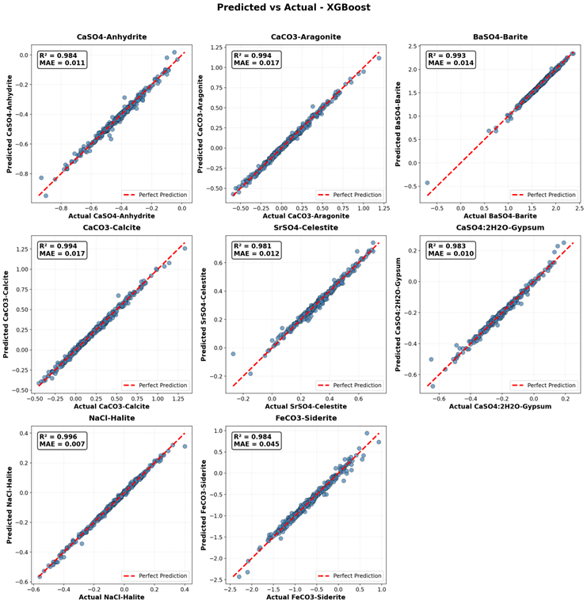
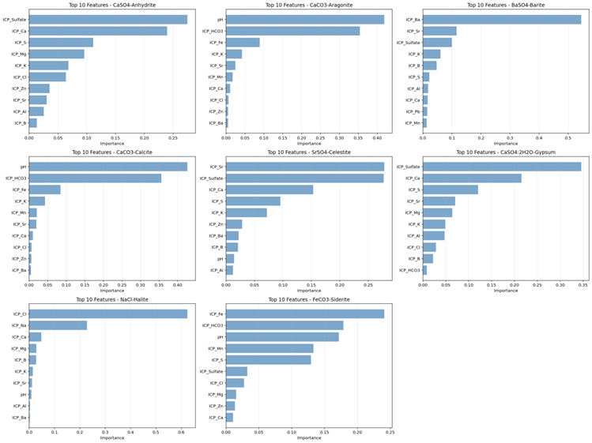

# Prediction-risk-type-mineral-scale-using-ML
Simultaneous prediction of **eight mineral scale precipitation tendencies**
(`CaSO₄-Anhydrite`, `CaCO₃-Aragonite`, `BaSO₄-Barite`, `CaCO₃-Calcite`,
`SrSO₄-Celestite`, `CaSO₄·2H₂O-Gypsum`, `NaCl-Halite`, `FeCO₃-Siderite`)
from fluid composition and operational conditions using four machine learning
regression models. Each model is hyperparameter‑tuned with **Optuna** and
evaluated across all targets.

---

## Methodology

| Step | Description |
|------|-------------|
| **Data split** | 70 % train, 15 % validation, 15 % test (two‑stage splitting, `random_state=48`) |
| **Preprocessing** | `RobustScaler` inside each pipeline to handle outliers |
| **Models** | `XGBoost`, `Random Forest`, `Decision Tree`, `MLP Neural Network` – all wrapped in `MultiOutputRegressor` for multi‑target prediction |
| **Hyperparameter tuning** | Optuna trials maximising **R² on the validation set** (10–50 trials depending on model complexity) |
| **Evaluation** | Overall and per‑target R², MAE, MSE; parity plots; feature importance (for tree‑based models) |

---

## Key Results

### 1. MAE Comparison Across Targets
Mean Absolute Error for each model broken down by the eight target minerals.
The plot reveals which targets are easier or harder to predict, and how the
models compare on a per‑target basis.

*Insert the grouped bar chart showing MAE per target for all four models.*

---

### 2. R² Across Models
Side‑by‑side comparison of overall R² scores. The best model is highlighted
with a gold border.

*Insert the bar chart comparing overall R² scores for XGBoost, Random Forest,
Decision Tree, and Neural Network.*

---

### 3. Parity Plot – All Models × All Targets
Predicted vs. actual scatter plots for every model–target combination. Each
subplot includes the R² and MAE values; the red dashed line marks perfect
prediction.

*Insert the multi‑panel parity plot (e.g., the `Predicted vs Actual` figure
generated for the best model, or a composite grid showing all models).*

---

### 4. Feature Importance Across All Models
Top features ranked by gain‑based importance (for tree‑based models) or
permutation importance (for the neural network). The plots highlight which
physicochemical parameters most strongly influence scale precipitation.

*Insert the feature importance heatmap or bar charts generated for the
tree‑based models. If available, also include the NN permutation importance.*

---

pip install numpy pandas matplotlib seaborn scikit-learn xgboost optuna shap openpyxl
